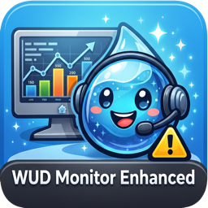

# WUD Monitor Enhanced

<p align="center">
  
</p>

A Home Assistant integration for [What's Up Docker (WUD)](https://github.com/getwud/wud) that tracks container update availability and exposes controls directly in Home Assistant.

[](https://github.com/lduda007/wud-monitor)

---

## Features

- **Per-container sensors** — update status, current version, new version, days available
- **Controller sensors** — total containers monitored, containers with updates, last poll time
- **Force scan buttons** — trigger WUD to re-check updates for all containers, a specific compose project, or a single container
- **Per-container trigger buttons** — run any WUD trigger (e.g. `docker.local`) on a container on demand, with a configurable exclusion list
- **Refresh states button** — re-fetch container data from WUD without triggering an update scan
- **Compose project grouping** — containers sharing a Docker Compose project are grouped under one HA device
- **Re-deploy safe** — sensor identity is based on container name and watcher, not the Docker container ID which changes on every redeploy
- **Configurable polling** — set how often HA polls WUD (default: 15 minutes)
- **Multi-instance support** — add multiple WUD instances, each gets its own devices and sensors

---

## Requirements

- Home Assistant 2024.1 or newer
- [HACS](https://hacs.xyz/) installed
- A running [What's Up Docker](https://github.com/getwud/wud) instance (tested with WUD 8.2+)

### WUD container labels

For WUD to monitor a container, add `wud.watch: "true"` to its `docker-compose.yml`:

```yaml
labels:
  - "wud.watch=true"
```

To stay on the same version track and avoid pre-releases or variant tags, add `wud.tag.include`:

```yaml
labels:
  - "wud.watch=true"
  # SemVer: stay on 2.0.x only
  - "wud.tag.include=^2\\.0\\.\\d+$"

  # CalVer: stay on same year.month.patch — no dev/rc builds
  - "wud.tag.include=^20[0-9]{2}\\.[0-9]+\\.[0-9]+$"

  # Block pre-releases and variant tags for any versioning scheme
  - "wud.tag.exclude=^.*(dev|alpha|beta|rc|alpine|slim|snapshot).*$"
```

---

## Installation

### Via HACS (recommended)

1. In HACS, go to **Integrations → ⋮ → Custom repositories**
2. Paste `https://github.com/lduda007/wud-monitor` and choose **Integration**
3. Click **Add**, then find **WUD Monitor Enhanced** and install it
4. Restart Home Assistant

[](https://my.home-assistant.io/redirect/hacs_repository/?owner=lduda007&repository=wud-monitor&category=integration)

### Manual installation

1. Copy the `custom_components/wud_monitor` folder to your HA `config/custom_components/` directory
2. Restart Home Assistant

---

## Configuration

Go to **Settings → Devices & Services → Add Integration** and search for **WUD Monitor Enhanced**.

| Field | Description | Default |
|---|---|---|
| **Host** | IP address or hostname of your WUD instance | — |
| **Port** | WUD web UI port | `3000` |
| **Instance name** | Friendly name shown as the Controller device in HA | `WUD` |
| **Poll interval** | How often HA fetches data from WUD (minutes) | `15` |
| **Triggers excluded** | Trigger identifiers (e.g. `docker.local`) for which no per-container trigger button is created | _(none)_ |
| **Add instance name to sensors** | Prefix per-container sensor and button names with the instance name, so entities can be told apart when multiple WUD instances are configured | `off` |

Settings can be changed later via the integration's **Configure** button.

---

## Devices and entities

### Controller device (`WUD @ {instance_name}`)

| Entity | Type | Description |
|---|---|---|
| Containers with Updates | Sensor | Number of containers that have an update available |
| Monitored Containers | Sensor | Total number of containers WUD is watching |
| Last Poll | Sensor | When HA last successfully fetched data from WUD |
| Force Scan All | Button | Triggers `POST /api/containers/watch` to re-check all containers |
| Refresh States | Button | Re-fetches current container data (`GET /api/containers`) without asking WUD to watch for new updates |

### Compose project device (`{instance_name} – {project}`)

One device per Docker Compose project. Linked to the Controller device via `via_device`.

| Entity | Type | Description |
|---|---|---|
| {container} Update Available | Sensor | Per-container update status |
| Force Scan | Button | Scans each container in the project individually |
| {container} Trigger {type}.{name} | Button | Runs the given WUD trigger on the container via `POST /api/containers/{id}/triggers/{type}/{name}` — one button per available trigger, minus any excluded triggers. State is refreshed immediately once the trigger request returns |

### Per-container sensor attributes

| Attribute | Description |
|---|---|
| `current_version` | Currently running version |
| `new_version` | Available update version (`–` if none) |
| `available_since` | When the new image was published (UTC) — only shown when update is available |
| `days_available` | Days since the new version became available — only shown when update is available |
| `semver_diff` | Severity: `patch`, `minor`, or `major` |
| `release_notes` | Link to the container's release notes / changelog — only shown when an update is available |
| `error` | Error message reported by WUD for this container (e.g. registry rate limit) — only shown when WUD reports an error |
| `image` | Full image name (e.g. `esphome/esphome`) |
| `registry` | Registry name (e.g. `ghcr.public`, `hub.public`) |
| `compose_project` | Docker Compose project name |
| `status` | Container runtime status (e.g. `running`) |
| `watcher` | WUD watcher name (e.g. `docker`) |
| `display_icon` | Icon for the container as reported by WUD (`displayIcon`) |
| `available_triggers` | Triggers configured for the container — the container's `triggerInclude` when set, otherwise the triggers fetched from `GET /api/containers/{id}/triggers` |

---

## Dashboard card

A ready-made Lovelace card is provided in [`lovelace/wud-monitor-dashboard.yaml`](lovelace/wud-monitor-dashboard.yaml). It is fully dynamic — it auto-discovers the integration's entities, so you never have to list containers by hand.

**What it shows**

- Containers grouped by **instance**, then by **watcher**, and inside each group split into **Update Available** (shown expanded) and **Up to date** (collapsed by default in an `expander-card`). The collapsible sections set an `expand-id`, so their open/closed state is remembered per browser across the card re-rendering after a poll or button press — this requires a recent `expander-card` version; older versions ignore it and reset to their default on each render.
- Each container shows its current version (`current → new` plus `(Nd ago)` when an update exists). The card's icon is **colour-coded by severity** (`semver_diff`): red = major, amber = patch, orange = minor/unknown, green = up to date. Icon-only controls per row:
  - **Rescan** (magnify-scan) — re-checks that single container for updates (the container's *Force Scan* button), after a confirmation prompt.
  - **Release notes** (note-text-outline) — opens the container's `release_notes` URL in a new tab. Only shown when an update is available.
  - **Update** (tray-arrow-down) — runs the container's WUD trigger, after a confirmation prompt. One Update button per available trigger.
- Containers WUD reported an `error` for are pulled out of the watcher groups into a collapsible **Errors** section per instance, flagged with a red alert icon; it defaults to expanded (so it stays visible after the card re-renders following a rescan) and shows each error message. Each errored row also has a **Rescan** (magnify-scan) button to retry the container's *Force Scan*.
- Per-instance controls: **Force Scan All** and **Refresh States**, plus summary chips for *containers with updates*, *monitored containers*, and *last poll*.
- Tapping a container opens its more-info dialog with all attributes.

**Requirements** — install from HACS → **Frontend**:

- [auto-entities](https://github.com/thomasloven/lovelace-auto-entities) (`thomasloven/lovelace-auto-entities`)
- [Mushroom](https://github.com/piitaya/lovelace-mushroom) (`piitaya/lovelace-mushroom`)
- [expander-card](https://github.com/Alia5/lovelace-expander-card) (`Alia5/lovelace-expander-card`) — for the collapsible "Up to date" section
- [card-mod](https://github.com/thomasloven/lovelace-card-mod) (`thomasloven/lovelace-card-mod`) — *optional*; widens the error message (~80%) vs its rescan button in the Errors section. Without it, those rows fall back to a 50/50 split.

**Install the card**

1. Open your dashboard → **Edit dashboard** → **＋ Add Card** → **Manual**.
2. Paste the contents of `lovelace/wud-monitor-dashboard.yaml` and save.

The card works with a single WUD instance or several — each configured instance gets its own section automatically.

> **Note:** the card derives each container's Rescan/Update buttons by matching entity names (`… Force Scan`, `… Trigger {type}.{name}`). If you rename these entities in Home Assistant, the matching buttons won't be found.
>
> **If you edit the template:** it must end with `{{ ns.cards }}` — do **not** add `| tojson`. auto-entities parses the plain output directly; `tojson` emits `\uXXXX` escapes its parser rejects, making every card show "Configuration error".

---

## Troubleshooting

**Integration fails to connect**
Verify that the WUD API is reachable:
```
http://<wud_host>:<wud_port>/api/containers
```
This should return a JSON array of your monitored containers.

**Duplicate sensors after container redeploy**
This integration uses `watcher + name` as the stable entity identity, not the Docker container ID. If you are upgrading from an older version that used container ID, delete the old `unavailable` entities manually under **Settings → Devices & Services**.

**Sensors not updating**
Check the poll interval in the integration settings. You can also press the **Force Scan All** button to trigger an immediate refresh.

---

## Contributions

Contributions are welcome! Open an issue or pull request on [GitHub](https://github.com/lduda007/wud-monitor).

---

## Credits & attribution

This project is based on the original WUD Monitor integration by [**@johro897**](https://github.com/johro897) — huge thanks for the original code base that this work builds upon.

**WUD Monitor Enhanced** extends that foundation with additional functionality, including:

- Per-container **trigger buttons** to run any WUD trigger on demand, with a configurable exclusion list
- **Refresh states** button to re-fetch data without triggering a scan
- **Richer sensor attributes** (icon, available triggers, release notes, error messages)
- **Multi-instance ergonomics** (optional instance-name prefixing on entities)
- A ready-made **Lovelace dashboard card**
- More accurate **version detection** and **immediate state refresh** after triggers
